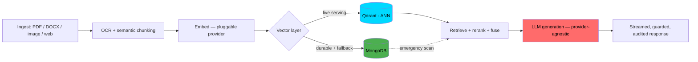
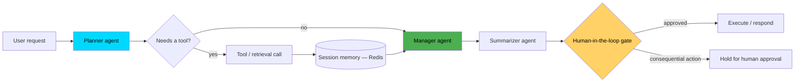

<div align="center">


<br>

📍 Mumbai, India &nbsp;·&nbsp; 🔗 [Portfolio](https://portfolio-nnqt6t6d1-sushvarma2-6895s-projects.vercel.app/) &nbsp;·&nbsp; 💼 [LinkedIn](https://linkedin.com/in/sushmavarma) &nbsp;·&nbsp; ✉️ sushvarma2@gmail.com

</div>


<!--
    if you're reading the raw markdown instead of the rendered page,
    you're exactly the kind of person this profile was built for. hi.
-->

<div align="center">

```
❯ curl -s https://api.sushmavarma.dev/v1/engineer | jq
```

```json
{
  "id": "sushma-varma",
  "endpoint": "/v1/engineer",
  "role": "AI / LLM Engineer",
  "region": "Mumbai, IN",
  "status": "production-ready",
  "uptime": "1.7y",
  "capabilities": [
    "retrieval-augmented-generation",
    "multi-tenant-architecture",
    "agentic-orchestration",
    "provider-agnostic-routing"
  ],
  "fallback_mode": "graceful — never hard-fails without a key",
  "confidence": 0.94,
  "human_in_the_loop": true,
  "response": "Hi, I'm Sushma. Thanks for querying my profile 🙂"
}
```

</div>


## `// HUMAN_LAYER`

I joined my current company as its **first and only AI engineer** — no infrastructure, no precedent, no one to hand a half-finished system to. That constraint shaped how I think: I don't build a feature until I've built the thing underneath it that lets every future feature reuse it.

**My working thesis:** a model is a component, not a product. The part that actually determines whether an AI system survives contact with real users — real traffic, real cost limits, real security review — is the engineering *around* the model: retrieval quality, fallback behavior, evaluation, and who's allowed to make an irreversible decision. That's the part I build.


## `AUDIENCE.ROUTE`

<sub>Pick whichever applies — this profile reads differently depending on why you're here.</sub>

<details>
<summary><b>🧑‍💼 I'm a recruiter / hiring manager</b></summary>
<br>

Skip to `SYSTEM.METRICS` for numbers, `DEPLOYED_SYSTEMS` for what I've shipped. Short version: 1.7 years, first AI hire at my current company, built the infrastructure layer solo, currently serving 100,000+ daily users in production. Contact info is at the bottom — I respond fast.

</details>

<details>
<summary><b>🧑‍💻 I'm an engineer evaluating the work</b></summary>
<br>

Skip to `AGENT_LAB` and `PATTERN.CORE` for the actual architecture, `EXPERIMENTAL.CHAMBER` for the tradeoffs I made and why. I'd rather you push back on a design decision than take a badge list at face value — that's genuinely the conversation I want.

</details>

<details>
<summary><b>🚀 I'm a founder / thinking about AI for my product</b></summary>
<br>

The short version: I build the boring, unglamorous 80% (retrieval quality, fallback behavior, auth, cost control) that makes the flashy 20% (the chat, the agent) trustworthy enough to actually launch. `SYSTEM.PRINCIPLES` below is the closest thing I have to a pitch.

</details>


## `SYSTEM.METRICS`

Not vanity numbers — every figure below is something I personally measured, tuned, or shipped.

| | |
|---|---|
| ⚡ **~22s → ~45ms** | Warm query latency cut on a 24,000+ vector multi-tenant corpus (hybrid Qdrant + MongoDB retrieval) |
| 👥 **100,000+** | Daily active users served by a multilingual banking assistant I built (90% intent-routing, 90% translation accuracy) |
| 🎯 **85%** | Scoring precision across every record in a deterministic AI job/candidate matching engine |
| 📄 **19,000+ / 500+** | Chunks / source documents in a government-scale RAG corpus, with a recall@k / MRR eval harness to regression-test retrieval quality |
| 🧪 **45** | Security-and-correctness regression tests I added after leading a full remediation pass (auth gaps, SSRF exposure, cross-tenant isolation) |
| 🌐 **7** | Scripts a single OCR engine I built reads natively — English, Hindi, Marathi, Bengali, Telugu, Kannada, Urdu |


## `SYSTEM.PRINCIPLES`

Most "skills" sections list tools. These are the *decisions* that show up across nearly everything I've built — ask me about any of them:

- **Deterministic core, LLM at the edges.** Scoring, routing, anything auditable stays in plain Python. The LLM writes the sentence; it doesn't make the call.
- **Provider-agnostic by default.** Every serious system I build swaps between Bedrock / Hugging Face / Ollama / OpenAI behind one environment variable — vendor lock-in is a business risk I refuse to hand my employer.
- **Fail soft, not fail loud.** A dead embedding provider, an unreachable vector store, or a missing API key degrades the system — it doesn't take it down. Every project I ship runs in a zero-key mock mode before it runs with real credentials.
- **Human-in-the-loop where it matters.** Auto-submitting an application, deciding someone's benefits eligibility, storing a permanent record — the LLM classifies and drafts; a human, or deterministic logic, approves.


## `PIPELINE.TRACE` — how a request actually moves through one of my systems

```
        ●───●
       ╱ ╲ ╱ ╲
      ●   ●   ●        ← this is the part I actually build:
       ╲ ╱ ╲ ╱             not the model, the system around it
        ●───●
```



*(Real architecture, not a diagram for the README's sake — nlucron, my company's shared RAG backbone, works exactly like this.)*


## `AGENT_LAB`

The agentic pattern I keep coming back to — planner/summarizer/manager agents with a hard boundary between "the agent decides what to do" and "the agent is allowed to act":



Built and shipped this pattern (Pydantic AI, structured outputs, real-time streaming) across multiple BFSI agentic systems — the gate before "execute" isn't decorative, it's the reason I trust these in production.


## `STACK.MANIFEST`

Organized by what each layer is actually for — not 50 badges in a row.

**Intelligence** — LLMs (Bedrock Nova, Qwen2.5, OpenAI, Claude), RAG, prompt engineering, structured/schema-validated generation
**AI Systems** — Agentic workflows (planner/summarizer/manager), tool calling, session memory, NVIDIA Guardrails, retrieval evaluation (recall@k, MRR, hit-rate)
**ML / Multimodal** — TensorFlow, PyTorch, on-device vision (coco-ssd), VLM scene description, Whisper STT, Piper TTS
**Backend** — Python, FastAPI, REST API design, async job orchestration
**Data** — MongoDB, Qdrant, Weaviate, FAISS, ChromaDB, Redis (Streams + pub/sub + TimeSeries)
**Infrastructure** — Docker, AWS (EC2, Bedrock, SSM), GitHub Actions + OIDC CI/CD, Trivy scanning

<div align="center">


</div>


## `MODEL.REGISTRY`

Not a "familiar with" list — every one of these is wired into a real, running system I built.

| Layer | Shipped with |
|---|---|
| **Text generation** | AWS Bedrock Nova (Lite / Pro / Micro, tiered per feature), Qwen2.5-7B-Instruct, OpenAI, Claude |
| **Embeddings** | BAAI/bge-m3 (1024-dim, self-hosted default), AWS Titan v2, OpenAI embeddings |
| **Vision** | Llama-4-Scout-17B (open-vocabulary scene description), on-device coco-ssd (real-time detection) |
| **Voice** | Whisper (STT), Piper (streamed TTS), ElevenLabs / OpenAI voice APIs |
| **Vector stores** | Qdrant (ANN serving), MongoDB (durable store + fallback scan), FAISS, Weaviate |

I pick the model per feature, not per project — a proposal-readiness scorer and a one-line intent classifier have no business calling the same model tier.


## `PATTERN.CORE` — provider-agnostic model routing

```python
# Illustrative — the shape of a pattern I've implemented across
# nlucron, DMRR, and Tender Search. Not literal production code.

class LLMFactory:
    """One switch to move a feature between providers — no rewrite,
    no redeploy of anything except an env var."""

    def __init__(self, feature: str):
        self.provider = settings.model_for(feature)  # "bedrock" | "huggingface" | "mock"

    def get_llm(self) -> LLMProvider:
        match self.provider:
            case "bedrock":
                return NovaLLM(model_id=settings.NOVA_MODEL_ID)
            case "huggingface":
                return HFLLM(model_id=settings.HF_MODEL_ID)
            case _:
                return MockLLM()  # every project I ship runs with zero API keys

# A dead provider, a missing key, or a regional outage
# degrades one feature — it never takes the platform down.
```


## `EXPERIMENTAL.CHAMBER`

Real engineering decisions, logged the way I'd want a teammate to find them later — hypothesis, what I actually did, what I learned. No filler entries.

<details open>
<summary><b>EXP-01 — Should retrieval serve from Qdrant alone, or stay hybrid with Mongo?</b></summary>
<br>

**Hypothesis:** a single vector store (Qdrant only) would be simpler to operate.
**What I did:** kept Qdrant as the live ANN-serving path but retained a durable, synced copy of every embedding in MongoDB alongside chunk text and metadata.
**Result:** extra write cost and a consistency surface to manage — but if Qdrant is down or a collection isn't backfilled, Mongo can brute-force cosine scan as a real fallback instead of the platform going dark. Traded write complexity for the system never having a single point of total failure.

</details>

<details>
<summary><b>EXP-02 — Ollama (self-hosted) vs. AWS Bedrock for the LLM layer</b></summary>
<br>

**Hypothesis:** self-hosted Ollama would be cheaper at scale than a managed API.
**What I did:** ran comparative cost and architecture analyses across self-hosted deployment vs. AWS Bedrock for real infra-spend decisions.
**Result:** migrated the primary LLM layer to Bedrock Nova via the Converse API for reliability and ops overhead — but kept the abstraction so a switch back to Ollama for on-prem/data-residency needs is a config change, not a rewrite.

</details>

<details>
<summary><b>EXP-03 — OCR: one engine, or a fallback chain?</b></summary>
<br>

**Hypothesis:** one solid OCR engine would cover the languages needed.
**What I did:** built a multi-script engine on EasyOCR (7 languages) with automatic Tesseract fallback for scripts EasyOCR handles poorly.
**Result:** fallback chains cost more code than a single dependency — but a document that would've silently failed OCR now degrades to a second engine instead of dropping data.

</details>


## `EVAL.LOG`

RAG that "feels" better isn't RAG that *is* better — so I built a retrieval regression harness (recall@k, MRR, hit-rate) into DMRR specifically so a prompt tweak or a reranker swap can be measured against a baseline, not judged by eyeballing five outputs. Same instinct behind the 45-test security/correctness suite I added to nlucron: if it isn't tested, it isn't shipped.


<a name="deployed_systems"></a>
## `DEPLOYED_SYSTEMS`

<details open>
<summary><b>Click to collapse / expand</b></summary>
<br>

| Project | What it does | Stack |
|---|---|---|
| **[nlucron](#)** — shared RAG backbone | Multi-tenant ingestion + retrieval platform I designed and built solo; every AI product at my company runs on it | `FastAPI` `Qdrant` `MongoDB` `Bedrock` |
| **[DMRR](#)** — government platform | RAG chatbot + AI proposal-readiness scorer + duplicate detection for a state disaster-management department | `LangChain` `LangGraph` `Bedrock Nova` |
| **[MediOra](#)** — talent/education AI | Deterministic scoring engine + skill-alias resolution after proving raw embeddings weren't precise enough | `FastAPI` `.NET integration` |
| **[Renewal Intelligence Engine](#)** | Churn-risk scoring across 6 messy B2B data sources with an auditable, LLM-at-the-edges design | `pandas` `HuggingFace` |
| **[Real-Time Market Insights](#)** | Kafka-style Redis Streams pipeline → sentiment scoring → LLM summaries → live WebSocket + Grafana dashboard | `Redis Streams` `FastAPI` `Grafana` |
| **[Travel Voice Assistant](#)** | Fully local, free voice agent — mic → Whisper STT → LangGraph ReAct agent → streamed Piper TTS | `LangGraph` `Whisper` `Piper` |

*(Swap the `#` links for your actual repo URLs once each is public.)*

</details>


## `ROADMAP.SELF`

Where I actually am, honestly plotted — not a wish list.

```
FOUNDATIONS ──▶ MODELS ──▶ RAG ──▶ AGENTS ──▶ MULTIMODAL ──▶ AI SYSTEMS ──▶ PRODUCTION
    ✅            ✅         ✅        ✅          🔶              ✅            ✅
                                                 (voice: Whisper/Piper;    (100K+ daily
                                                  vision: image summ.)      users, live)
```

Current edge: multimodal is the newest muscle — voice pipelines (Whisper/Piper) and vision-based image summarization in production — and eval-driven RAG development is the thing I want to get sharper at next, not because it's trendy but because "feels better" isn't a metric I trust myself with anymore.


## `OBSESSIONS.LOG`

- Provider abstraction — I will always add the environment-variable switch, even when nobody asked for it yet.
- Deterministic-core-first design — I distrust any scoring system I can't explain in plain English without mentioning a model.
- Local-first fallback (Ollama, on-device vision) — not everything needs a cloud round-trip, and not every client can send data to one.
- Retrieval evaluation — a RAG system without a recall@k number is a RAG system I don't fully trust yet, including my own.
- Fail-soft design — the failure mode of a feature should be "worse," never "down."


## `// HUMAN_LAYER.EXPAND`

<details>
<summary><b>Click to see the human behind the commits 🙂</b></summary>
<br>

I don't think a wall of badges tells you who someone actually is, so — genuinely, not for the algorithm:

- 📖 I read webtoons and watch dramas on a near-daily basis — it's my actual unwind, not a "hobbies" filler line.
- 🗣️ I'm picking up Japanese (N5) and Korean (A1) on the side — partly the dramas' fault, partly just liking the process of getting good at something slowly.
- 👨‍👩‍👧 Family time is non-negotiable for me — it's where I recharge, not where I fit work in around.
- 😴 I protect my sleep. I've shipped better code at 9am after real rest than at midnight running on nothing — I plan my work around that, not against it.

If none of that shows up in a commit history, that's the point — it's what makes the commit history sustainable.

<!-- if you found this, you also read EXP-01 through 03 above. that's the kind of curiosity I actually hire for. -->

</details>


## `SYSTEM.CREDENTIALS`

<div align="center">

[](https://academy.langchain.com/certificates/vvxhz5nfrx)
[](https://academy.langchain.com/certificates/vlfamvs87y)
[](https://www.credly.com/badges/522e5bea-be60-4fe0-aaf0-315ad22a9a20/public_url)
[](https://www.credly.com/badges/24f607d6-cf29-45da-a463-7a7eb543db91/public_url)
[](https://www.credly.com/badges/2ea5839f-b572-4968-a9c5-45dc57a07af0/public_url)

*(Click any badge — every one links to my live, verifiable Credly/certificate page.)*

</div>


## `SYSTEM.TELEMETRY`

<div align="center">


<br><br>


<br>

<!-- Contribution snake — requires the GitHub Action in .github/workflows/snake.yml -->


</div>


## `CURRENTLY_BUILDING`

```python
class Sushma:
    def __init__(self):
        self.role = "AI / LLM Engineer"
        self.building = "nlucron — a multi-tenant RAG platform, from scratch, solo"
        self.learning = ["agentic orchestration at scale", "eval-driven RAG development"]
        self.open_to = "AI Agentic Engineer / GenAI roles"

    def get_in_touch(self):
        return "sushvarma2@gmail.com"
```

<br>


<div align="center">

### `SYSTEM.CONNECTION_ESTABLISHED`

📫 **sushvarma2@gmail.com** &nbsp;|&nbsp; [LinkedIn](https://linkedin.com/in/sushmavarma) &nbsp;|&nbsp; [Portfolio](https://portfolio-nnqt6t6d1-sushvarma2-6895s-projects.vercel.app/) &nbsp;|&nbsp; [GitHub](https://github.com/SushVarma)

*If you scrolled this far and read the EXP log — you're exactly who this profile was built to find. Say hi.*

</div>
