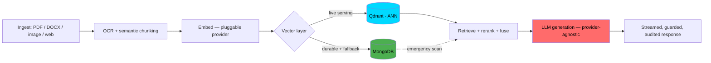

<div align="center">

<!-- Animated intro line -->


### Hi, I'm Sushma Varma 👋

I design and ship production RAG and agentic AI systems — the kind that hold up under real traffic, real security review, and real cost constraints, not just a demo. I was the first and only AI engineer at my current company, which meant building the infrastructure layer *before* I could build anything on top of it.

📍 Mumbai, India &nbsp;·&nbsp; 🔗 [Portfolio](https://portfolio-nnqt6t6d1-sushvarma2-6895s-projects.vercel.app/) &nbsp;·&nbsp; 💼 [LinkedIn](https://linkedin.com/in/sushmavarma) &nbsp;·&nbsp; ✉️ sushvarma2@gmail.com

</div>

<br>

## By the numbers

Not vanity metrics — every figure below is something I personally measured, tuned, or shipped.

| | |
|---|---|
| ⚡ **~22s → ~45ms** | Warm query latency cut on a 24,000+ vector multi-tenant corpus (hybrid Qdrant + MongoDB retrieval) |
| 👥 **100,000+** | Daily active users served by a multilingual banking assistant I built (90% intent-routing, 90% translation accuracy) |
| 🎯 **85%** | Scoring precision across every record in a deterministic AI job/candidate matching engine |
| 📄 **19,000+ / 500+** | Chunks / source documents in a government-scale RAG corpus, with a recall@k / MRR eval harness to regression-test retrieval quality |
| 🧪 **45** | Security-and-correctness regression tests I added after leading a full remediation pass (auth gaps, SSRF exposure, cross-tenant isolation) |
| 🌐 **7** | Scripts a single OCR engine I built reads natively — English, Hindi, Marathi, Bengali, Telugu, Kannada, Urdu |

<br>

## What I actually think about when I build

Most "skills" sections list tools. These are the *decisions* that show up across almost everything I've built — the ones worth asking me about in an interview:

- **Deterministic core, LLM at the edges.** Scoring, routing, and anything auditable stays in plain Python. The LLM writes the sentence, it doesn't make the call.
- **Provider-agnostic by default.** Every serious system I build can swap between Bedrock / Hugging Face / Ollama / OpenAI behind one environment variable — because vendor lock-in is a business risk I refuse to hand my employer.
- **Fail soft, not fail loud.** A dead embedding provider, an unreachable vector store, or a missing API key degrades the system — it doesn't take it down. Every project I ship runs in a zero-key mock mode before it runs with real credentials.
- **Human-in-the-loop where it matters.** Auto-submitting an application, deciding someone's benefits eligibility, storing a permanent record — an LLM classifies and drafts; a human (or deterministic logic) approves.

<br>

## How a request actually moves through one of my systems



*(This is a real architecture I've shipped, not a diagram for the README's sake — nlucron, my company's shared RAG backbone, works exactly like this.)*

<br>

## Featured builds

| Project | What it does | Stack |
|---|---|---|
| **[nlucron](#)** — shared RAG backbone | Multi-tenant ingestion + retrieval platform I designed and built solo; every AI product at my company runs on it | `FastAPI` `Qdrant` `MongoDB` `Bedrock` |
| **[DMRR](#)** — government platform | RAG chatbot + AI proposal-readiness scorer + duplicate detection for a state disaster-management department | `LangChain` `LangGraph` `Bedrock Nova` |
| **[MediOra](#)** — talent/education AI | Deterministic scoring engine + skill-alias resolution after proving raw embeddings weren't precise enough | `FastAPI` `.NET integration` |
| **[Renewal Intelligence Engine](#)** | Churn-risk scoring across 6 messy B2B data sources with an auditable, LLM-at-the-edges design | `pandas` `HuggingFace` |
| **[Real-Time Market Insights](#)** | Kafka-style Redis Streams pipeline → sentiment scoring → LLM summaries → live WebSocket + Grafana dashboard | `Redis Streams` `FastAPI` `Grafana` |
| **[Travel Voice Assistant](#)** | Fully local, free voice agent — mic → Whisper STT → LangGraph ReAct agent → streamed Piper TTS | `LangGraph` `Whisper` `Piper` |

*(Swap the `#` links for your actual repo URLs once each is public.)*

<br>

## Stack

<div align="center">


</div>

<br>

## GitHub activity

<div align="center">


</div>

<br>

## Off the clock

I don't think a wall of badges tells you who someone actually is, so — genuinely, not for the algorithm:

- 📖 I read webtoons and watch dramas on a near-daily basis — it's my actual unwind, not a "hobbies" filler line.
- 🗣️ I'm picking up Japanese (N5) and Korean (A1) on the side — partly the dramas' fault, partly just liking the process of getting good at something slowly.
- 👨‍👩‍👧 Family time is non-negotiable for me — it's where I recharge, not where I fit work in around.
- 😴 I protect my sleep. I've shipped better code at 9am after real rest than at midnight running on nothing — I plan my work around that, not against it.

If none of that shows up in a commit history, that's the point — it's what makes the commit history sustainable.

<br>

## Currently

```python
class Sushma:
    def __init__(self):
        self.role = "AI / LLM Engineer"
        self.building = "nlucron — a multi-tenant RAG platform, from scratch, solo"
        self.learning = ["agentic orchestration at scale", "eval-driven RAG development"]
        self.open_to = "AI Agentic Engineer / GenAI roles"

    def get_in_touch(self):
        return "sushvarma2@gmail.com"
```

<br>

<div align="center">

📫 Let's talk — **sushvarma2@gmail.com** &nbsp;|&nbsp; [LinkedIn](https://linkedin.com/in/sushmavarma) &nbsp;|&nbsp; [Portfolio](https://portfolio-nnqt6t6d1-sushvarma2-6895s-projects.vercel.app/)

</div>